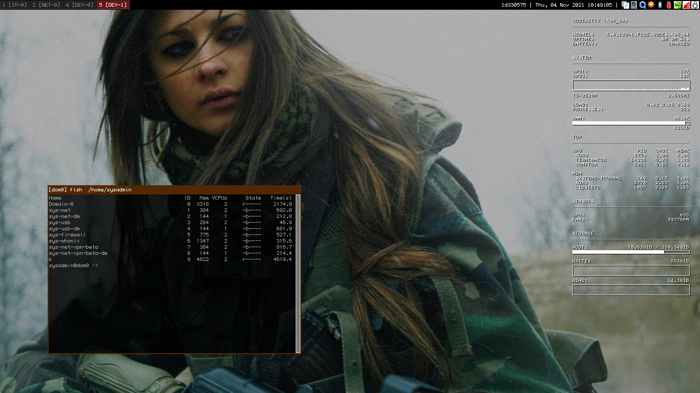

# qubes4.x + i3 + conky + compton



## Important details:

**Qubes Install (dom0):**

	username: sysadmin

## install stuff
```sh
# ux, misc
sudo qubes-dom0-update i3 arandr lxappearance fish xfce4-screenshooter numix-gtk-theme numix-icon-theme numix-icon-theme-circle htop tmux i3status redshift nitrogen geany gdk-pixbuf2-devel terminator i3-settings-qubes util-linux-user gnome-disk-utility lm_sensors pulseaudio-equalizer xbacklight make

## minimal f30 vm
sudo qubes-dom0-update template-fedora-30-minimal
```

## installing [lucy/tewi](https://github.com/lucy/tewi-font) (bitmap font)
https://github.com/lucy/tewi-font
```sh
qvm-run --pass-io vault 'cat /home/user/tewi-font.zip' > tewi-font.zip
unzip tewi-font.zip
cd tewi-font
make
sudo mv out /usr/share/fonts/
sudo fc-cache -fv
```

## allow bitmap fonts
```sh
sudo rm /etc/fonts/conf.d/25-no-bitmap-fedora.conf
sudo rm /etc/fonts/conf.d/10-scale-bitmap-fonts.conf
```

## building & installing compton

https://github.com/chjj/compton

### dependencies
***source:** https://github.com/chjj/compton#dependencies*
```sh
sudo qubes-dom0-update toolchain meson dbus-devel gcc git libconfig-devel libdrm-devel libev-devel libX11-devel libX11-xcb libXext-devel libxcb-devel mesa-libGL-devel meson pcre-devel pixman-devel uthash-devel xcb-util-image-devel xcb-util-renderutil-devel xorg-x11-proto-devel libXcomposite-devel libXdamage-devel libXfixes-devel libxrender-devel libXrandr-devel libXinerama-devel pkg-config make xproto xprop xwininfo pcre-devel libGL-devel asciidoc
```

### get compton source into dom0
```sh
mkdir ~/build
cd ~/build
qvm-run --pass-io internet-vm 'cat /home/user/Documents/compton-dual_kawase.zip' > /home/sysadmin/build/compton.zip
unzip compton.zip
cd compton-dual_kawase/
```

### building
```sh
make
sudo make install
```

### running
```sh
compton --config ~/.config/compton.conf
```